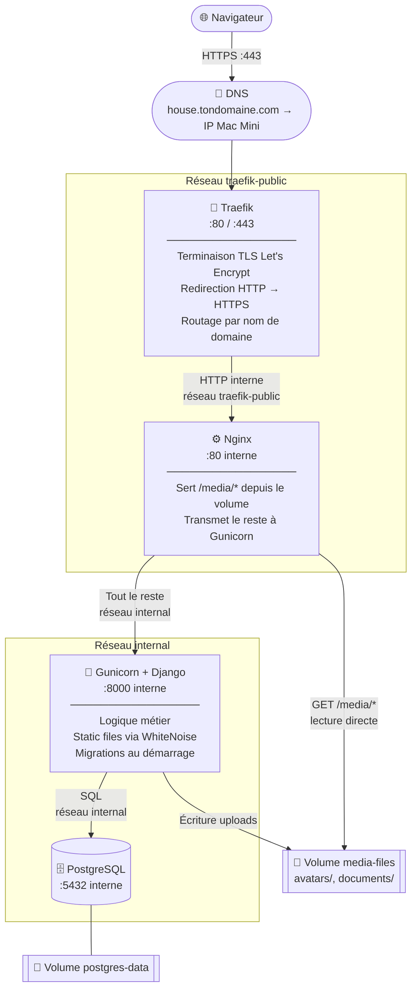

# Déploiement — **le déploiement de l'auteur**

> ⚠️ **Ce document décrit une installation précise : celle de l'auteur.** Un VPS,
> Traefik en frontal, un runner de CI auto-hébergé, une image construite sur la
> machine, un domaine. Il suppose tout ça et ne s'en excuse pas.
>
> **Pour héberger Maisonnée chez vous, ce n'est pas ici** : c'est
> [`docs/self-hosting/`](docs/self-hosting/README.md) — trois lignes, une image
> déjà construite, aucune de ces hypothèses.
>
> Ce fichier reste pour deux raisons. Il porte les **invariants du §3.4**
> (résolveur nginx, montage par répertoire, `--no-deps`, migrer avant de
> basculer), que la pile auto-hébergée hérite ou contourne explicitement — et
> `nginx/test-resilience.sh` les tient. Et il documente le seul déploiement qui
> tourne réellement en production aujourd'hui.
>
> Les deux piles partagent le même code et la même image ; elles ne partagent
> pas leurs hypothèses, et c'est pour ça qu'elles restent deux fichiers.

## Table des matières

1. [Leçon réseau — les bases](#1-leçon-réseau--les-bases)
2. [Architecture](#2-architecture)
3. [Fichiers créés](#3-fichiers-créés)
4. [Prérequis](#4-prérequis)
5. [Installation pas à pas](#5-installation-pas-à-pas)
6. [Mises à jour](#6-mises-à-jour)
7. [Commandes utiles](#7-commandes-utiles)
8. [Backups](#8-backups)
9. [Recommandations](#9-recommandations)
10. [Dépannage](#10-dépannage)
11. [L'instance de démonstration](#11-linstance-de-démonstration)

---

## 1. Leçon réseau — les bases

> Cette section explique les concepts réseau utilisés dans ce déploiement. En tant que dev full-stack habitué au code plutôt qu'à l'infra, ces notions reviennent à chaque projet — autant les avoir quelque part.

### 1.1 Comment une requête arrive jusqu'à ton app

Quand tu tapes `https://house.tondomaine.com` dans un navigateur, voici ce qui se passe dans l'ordre :

```
1. Navigateur        → "C'est quoi l'IP de house.tondomaine.com ?"
2. DNS               → "C'est 192.168.1.42" (l'IP de ton Mac Mini)
3. Navigateur        → envoie la requête à 192.168.1.42:443
4. Traefik           → reçoit sur le port 443, déchiffre le TLS
5. Nginx             → reçoit la requête en HTTP simple (réseau interne)
6. Django/Gunicorn   → traite la requête, renvoie une réponse
7. (chemin inverse)  → la réponse remonte jusqu'au navigateur
```

Chaque maillon fait une chose précise et passe la main au suivant.

---

### 1.2 DNS — faire pointer un domaine vers ton serveur

Le **DNS** (Domain Name System) est l'annuaire d'internet : il traduit un nom de domaine en adresse IP.

Pour que `house.tondomaine.com` arrive sur ton Mac Mini, tu dois créer un **enregistrement A** chez ton registrar (où tu as acheté le domaine) :

```
Type : A
Nom  : house          (ou @ pour le domaine racine)
Valeur : <IP publique de ton Mac Mini>
TTL  : 3600
```

> **Trouver l'IP publique de ton Mac Mini :**
> ```bash
> curl ifconfig.me
> ```

> **Attention — IP fixe ou dynamique ?**
> La plupart des connexions résidentielles ont une IP publique qui peut changer. Si c'est ton cas, soit tu souscris à une IP fixe chez ton FAI, soit tu utilises un service de **DNS dynamique** (DynDNS, Cloudflare, etc.) qui met à jour l'enregistrement automatiquement.

---

### 1.3 Ports — les "portes" du serveur

Un serveur a 65 535 ports. Chaque service écoute sur un port précis. Les deux qui nous intéressent :

| Port | Protocole | Rôle |
|------|-----------|------|
| 80   | HTTP      | Web non chiffré — Traefik le redirige vers 443 |
| 443  | HTTPS     | Web chiffré (TLS) — toutes les vraies requêtes passent par là |

Les autres ports (8000 pour Gunicorn, 5432 pour PostgreSQL) ne sont **jamais exposés** à internet dans notre config — ils ne sont accessibles qu'entre les containers Docker sur le réseau interne.

> **Sur ton routeur/box**, il faut que les ports 80 et 443 soient **redirigés** vers l'IP locale du Mac Mini. C'est la **redirection de port** (port forwarding). Sans ça, les requêtes venant d'internet n'atteignent jamais le Mac Mini.

---

### 1.4 TLS / HTTPS — chiffrer les communications

**HTTP** envoie tout en clair sur le réseau. **HTTPS** = HTTP + chiffrement TLS.

Pour chiffrer, il faut un **certificat TLS** délivré par une autorité de certification. **Let's Encrypt** est une autorité gratuite et automatique. Traefik s'en occupe tout seul :

1. Let's Encrypt demande à Traefik de prouver qu'il contrôle le domaine
2. Traefik répond au défi (TLS challenge) sur le port 443
3. Let's Encrypt délivre le certificat (valable 90 jours)
4. Traefik renouvelle automatiquement avant expiration

Tu n'as rien à faire — c'est entièrement automatique dès que le DNS pointe vers ton Mac Mini.

---

### 1.5 Reverse proxy — le rôle de Traefik et Nginx

Un **proxy** est un intermédiaire entre un client et un serveur. Un **reverse proxy** est un intermédiaire côté serveur : il reçoit les requêtes des clients et les distribue vers les bons services.

**Traefik** est un reverse proxy *orienté routage réseau* :
- Il regarde le nom de domaine de la requête (`house.tondomaine.com` vs `traefik.tondomaine.com`)
- Il consulte les labels Docker pour savoir vers quel container router
- Il gère le TLS et la redirection HTTP → HTTPS
- Il **ne lit jamais des fichiers** — il ne fait que router

**Nginx** est un reverse proxy *orienté contenu* :
- Il peut lire des fichiers sur le disque et les servir directement
- Il peut transmettre des requêtes à une autre application (Gunicorn)
- Il ne gère pas le TLS dans notre config — Traefik s'en charge en amont

```
Traefik  =  aiguilleur de train   → "ce train va sur quelle voie ?"
Nginx    =  chef de gare          → "fichier statique ou appli Django ?"
Django   =  le train lui-même     → traite la logique métier
```

---

### 1.6 Réseaux Docker — l'isolation des containers

Par défaut, les containers Docker sont isolés. Pour qu'ils communiquent, ils doivent être sur le même **réseau Docker**.

Dans notre stack, on a deux réseaux :

**`traefik-public`** (externe, partagé avec Traefik)
- Traefik + Nginx y sont connectés
- C'est la seule "porte vers internet"
- Gunicorn et PostgreSQL n'y sont **pas** → ils ne sont jamais accessibles depuis l'extérieur

**`internal`** (privé, créé par notre docker-compose)
- Nginx + Gunicorn + PostgreSQL y sont connectés
- Nginx peut parler à Gunicorn via `http://web:8000`
- Gunicorn peut parler à PostgreSQL via `db:5432`
- Ces noms (`web`, `db`) sont les noms des services dans `docker-compose.prod.yml` — Docker fait la résolution DNS automatiquement

```
Internet ──► traefik-public ──► Nginx
                                  │
                               internal
                                  ├──► Gunicorn (web:8000)
                                  └──► PostgreSQL (db:5432)
```

PostgreSQL n'est **jamais exposé à internet** — il n'est accessible que depuis les containers du réseau `internal`. C'est l'isolation par défaut que Docker permet d'avoir facilement.

---

### 1.7 Volumes Docker — persister les données

Un container Docker est **éphémère** : si tu le supprimes et le recrées, tout ce qu'il contenait disparaît. Pour persister des données, on utilise des **volumes**.

Dans notre stack :

| Volume | Monté dans | Contenu |
|--------|-----------|---------|
| `postgres-data` | `/var/lib/postgresql/data` dans `db` | Toute la base de données |
| `media-files` | `/app/media` dans `web` et `nginx` | Avatars et documents uploadés |

Les volumes survivent aux suppressions/recréations de containers. C'est pourquoi `docker compose down` ne supprime **pas** les données — il faut explicitement `docker compose down -v` pour ça (à ne faire qu'en cas de reset complet voulu).

---

## 2. Architecture



**Réseaux Docker :**
- `traefik-public` (externe, partagé avec Traefik) — Nginx uniquement
- `internal` (privé) — Nginx + Gunicorn + PostgreSQL

**Volumes Docker persistants :**
- `postgres-data` — données de la base PostgreSQL
- `media-files` — uploads utilisateurs (avatars, documents)

---

## 3. Fichiers créés

| Fichier | Rôle |
|---|---|
| `Dockerfile` | Build multi-stage : Node (React) → Python (Django/Gunicorn) |
| `docker-compose.prod.yml` | Stack complète : db + web + nginx |
| `nginx/conf.d/default.conf` | Config Nginx : media files + proxy vers Gunicorn |
| `nginx/html/maintenance.html` | Page servie quand Django ne répond pas (§ 3.4) |
| `nginx/test-resilience.sh` | Test de régression du proxy, lancé en CI (§ 3.4) |
| `.env.production.example` | Template des variables d'environnement |
| `.dockerignore` | Exclut venv, node_modules, secrets, etc. du build |

### Dockerfile — build multi-stage

Le build se fait en deux étapes pour ne pas embarquer Node.js dans l'image finale :

1. **Stage `frontend` (node:22-alpine)** — installe les dépendances npm et compile le React (`npm run build`). L'output va dans `static/react/`.
2. **Stage final (python:3.12-slim)** — installe les dépendances Python, copie le code, copie les assets React compilés depuis le stage 1, exécute `collectstatic`, et déclare Gunicorn en `CMD`.

### Démarrage du container

Il n'y a **pas d'entrypoint** : l'image déclare directement
`CMD ["gunicorn", …]` (4 workers, timeout 60 s — c'est là qu'on change le nombre
de workers). Deux conséquences voulues :

- **Le chemin de démarrage ne fait que démarrer le serveur.** `collectstatic` a
  lieu au build, plus à chaque boot de conteneur.
- **Le `CMD` reste remplaçable**, ce qui permet au deploy de lancer
  `compose run --rm web python manage.py migrate` sur l'image neuve — donc de
  migrer *avant* de basculer le trafic (§ 3.4). Un `ENTRYPOINT` qui ignore ses
  arguments, comme l'ancien `docker-entrypoint.sh`, rendait ça impossible.

Les **migrations** ne tournent pas au démarrage : elles sont une étape explicite
du pipeline de deploy.

### 3.4 Redéploiement — pourquoi on ne voit plus de 502

Le symptôme : pendant chaque redéploiement, le navigateur affichait un
`502 Bad Gateway` brut jusqu'à ce qu'on recharge à la main (issue #449). Trois
causes cumulées, et le correctif de chacune est à préserver.

**1. nginx figeait la résolution DNS de `web`.** Un `proxy_pass http://web:8000`
littéral est résolu **une seule fois, au chargement de la config** ; l'IP est
gardée pour la vie du process. Or chaque recréation du conteneur `web` lui donne
une nouvelle IP : nginx continuait de taper l'ancienne. Le 502 finissait par
passer seulement parce que compose recréait nginx à son tour (`depends_on`) — un
`docker compose restart web` seul, lui, cassait la prod jusqu'au prochain
redémarrage de nginx.

→ `resolver 127.0.0.11` **et** `proxy_pass http://$django` (sur variable). Il faut
les deux : sans variable, le resolver ne sert à rien.

Le `valid=5s` du resolver **borne** la bascule, il ne la rend pas instantanée : le
DNS interne de Docker annonce un TTL de 600 s, que nginx respecterait sinon. Après
une recréation de `web`, nginx peut donc viser l'ancienne IP jusqu'à 5 s — page de
maintenance à l'appui — puis converge seul, sans reload.

**2. Rien à servir pendant le trou.** Un 502/503/504 remonte désormais
`nginx/html/maintenance.html` en **503 + `Retry-After`**, et du **JSON** sur
`/api/` (l'intercepteur axios lit `detail` ; du HTML lui vaudrait une erreur de
parsing en place du motif). La page sonde `/health/` et se recharge d'elle-même
dès que l'app répond.

**3. L'ordre des étapes.** Le pipeline (`.github/workflows/ci.yml`) :

```
build web                                  # image neuve
up -d --no-deps db nginx                   # nginx reste debout, il n'est PAS recréé
run --rm --no-deps web … migrate           # migrer AVANT de basculer
up -d --no-deps --wait web scheduler …     # basculer, puis attendre /health/
exec nginx nginx -t && nginx -s reload     # recharger le conf sans couper
```

- **`--no-deps` partout** : sans lui compose recrée nginx dans la foulée de web,
  donc le proxy tombe pendant l'opération et sa page de maintenance ne sert plus à
  rien.
- **Migrer avant de basculer** : l'ordre inverse laissait le code neuf servir
  quelques secondes sur l'ancien schéma. Contrepartie assumée, la moins chère des
  deux : l'ancien code voit le nouveau schéma le temps du basculement — une
  migration additive lui est transparente, une migration **destructive** (colonne
  supprimée ou renommée) doit donc être livrée **en deux fois**.
- **`--wait`** s'appuie sur le healthcheck de `web` (`GET /health/`) : le job ne
  continue que quand gunicorn accepte vraiment des connexions, et **échoue
  bruyamment** si le conteneur neuf ne démarre pas.
- **Le conf est monté par répertoire** (`./nginx/conf.d:/etc/nginx/conf.d`), sans
  quoi le `reload` ci-dessus ne rechargerait rien : un bind mount de fichier unique
  **épingle l'inode**, et `git reset --hard` remplace le fichier au lieu de
  l'éditer. Le conteneur garderait l'ancien contenu pour toujours. Symptôme vécu :
  le repo annonçait un `gzip_types` corrigé, la prod servait l'ancien, et
  `nginx -t` passait — sur l'ancien.

**Ce qui reste vrai** : il subsiste une courte interruption (quelques secondes, le
temps d'arrêter l'ancien conteneur et de démarrer le neuf). Elle est désormais
*visible* et *auto-résolue* côté navigateur, pas supprimée. La faire disparaître
demanderait deux répliques de `web` et l'engagement permanent d'écrire des
migrations rétro-compatibles — ce n'est pas le contrat actuel.

**Régression** : `nginx/test-resilience.sh` (job `proxy` de la CI, bloquant pour le
deploy) monte un nginx sur un réseau Docker jetable et vérifie les trois
propriétés : il démarre sans `web`, il sert la page de maintenance, et il suit
`web` **recréé sur une nouvelle IP** sans reload.

### Pourquoi Nginx en plus de Gunicorn ?

Django ne sert les fichiers `/media/` (uploads utilisateurs) qu'en mode `DEBUG=True`. En production, il faut un serveur web dédié. WhiteNoise ne gère que les fichiers statiques (collectstatic), pas les uploads dynamiques. Nginx est configuré pour :
- Servir `/media/` directement depuis le volume `media-files` (avatars, documents)
- Proxifier tout le reste vers Gunicorn en passant le header `X-Forwarded-Proto` (nécessaire pour que Django reconnaisse les requêtes comme HTTPS derrière Traefik)

---

## 4. Prérequis

### Sur le Mac Mini

- [ ] Docker Desktop (ou Docker Engine) installé
- [ ] Traefik déjà en cours d'exécution avec le réseau `traefik-public`
- [ ] Un domaine DNS pointant vers l'IP du Mac Mini (ex: `house.tondomaine.com`)
- [ ] Git installé
- [ ] Accès SSH configuré

### Vérifier que Traefik tourne

```bash
docker ps | grep traefik
# doit afficher un container en état "Up"
```

### Vérifier que le réseau traefik-public existe

```bash
docker network ls | grep traefik-public
# doit afficher la ligne
```

---

## 5. Installation pas à pas

### Étape 1 — Pousser le code (depuis ta machine de dev)

```bash
git add Dockerfile docker-compose.prod.yml \
        nginx/conf.d/ nginx/html/ .env.production.example .dockerignore
git commit -m "feat: add Docker production deployment config"
git push
```

### Étape 2 — Se connecter au Mac Mini

```bash
ssh ton-user@mac-mini
```

### Étape 3 — Cloner le repo

```bash
git clone git@github.com:ton-user/maisonnee.git ~/Developer/house
cd ~/Developer/house
```

### Étape 4 — Créer le fichier `.env`

```bash
cp .env.production.example .env
nano .env   # ou vim, selon ta préférence
```

Remplir chaque valeur :

```env
# Remplacer house.tondomaine.com par ton vrai domaine
DOMAIN=house.tondomaine.com
ALLOWED_HOSTS=house.tondomaine.com
CSRF_TRUSTED_ORIGINS=https://house.tondomaine.com
CORS_ALLOWED_ORIGINS=https://house.tondomaine.com

# Générer une clé secrète forte :
# openssl rand -base64 50
SECRET_KEY=<résultat de openssl rand -base64 50>

# Choisir un mot de passe PostgreSQL fort
POSTGRES_PASSWORD=un-mot-de-passe-fort-ici
DATABASE_URL=postgres://house_user:un-mot-de-passe-fort-ici@db:5432/house

# Ces valeurs sont correctes telles quelles
DJANGO_SETTINGS_MODULE=config.settings.production
DEBUG=False
SECURE_SSL_REDIRECT=True
USE_X_FORWARDED_PROTO=True
SESSION_COOKIE_SECURE=True
CSRF_COOKIE_SECURE=True
```

> **Important :** `DATABASE_URL` utilise `db` comme hostname — c'est le nom du service Docker défini dans `docker-compose.prod.yml`. Ne pas mettre `localhost`.

### Étape 5 — Build et démarrage

```bash
docker compose -f docker-compose.prod.yml up -d --build
```

Le premier build prend environ 3 à 5 minutes (compilation React + installation des dépendances Python).

### Étape 6 — Vérifier que tout tourne

```bash
docker compose -f docker-compose.prod.yml ps
```

Les trois services doivent être en état `Up` :

```
NAME          IMAGE          STATUS
house-db-1    postgres:16    Up
house-web-1   house:latest   Up
house-nginx-1 nginx:alpine   Up
```

Consulter les logs en cas de problème :

```bash
docker compose -f docker-compose.prod.yml logs -f
# ou uniquement un service :
docker compose -f docker-compose.prod.yml logs -f web
```

### Étape 7 — Créer le compte administrateur

```bash
docker compose -f docker-compose.prod.yml exec web python manage.py createsuperuser
```

### Étape 8 — Vérifier dans le navigateur

Ouvrir `https://house.tondomaine.com` — Traefik doit avoir obtenu le certificat Let's Encrypt automatiquement (peut prendre 30 secondes au premier accès).

### Étape 9 — (Optionnel) Activer les notifications push

La PWA peut envoyer des notifications push (Web Push / VAPID). Sans clés, tout marche
mais l'envoi est un no-op. Pour activer :

```bash
# Générer une paire de clés VAPID
docker compose -f docker-compose.prod.yml exec web python manage.py generate_vapid_keys
# Copier VAPID_PUBLIC_KEY / VAPID_PRIVATE_KEY dans .env, ajouter VAPID_ADMIN_EMAIL=<contact>
nano .env
# Recréer les conteneurs qui envoient (web = événements/test, scheduler = pings)
docker compose -f docker-compose.prod.yml up -d --force-recreate web scheduler
# Vérifier
docker compose -f docker-compose.prod.yml exec web \
  python manage.py shell -c "from webpush.service import is_configured; print(is_configured())"
```

Concepts + architecture : [docs/fiches/PWA_PUSH.md](docs/fiches/PWA_PUSH.md) · module : [docs/MODULES/webpush.md](docs/MODULES/webpush.md).

---

## 6. Mises à jour

Pour déployer une nouvelle version de l'app :

```bash
cd ~/apps/house
git pull
docker compose -f docker-compose.prod.yml up -d --build
```

Les migrations sont appliquées automatiquement au démarrage du nouveau container. L'ancien container reste actif pendant le build, ce qui minimise l'indisponibilité.

---

## 7. Commandes utiles

```bash
# Logs en temps réel
docker compose -f docker-compose.prod.yml logs -f

# Shell Django (pour déboguer, créer des objets, etc.)
docker compose -f docker-compose.prod.yml exec web python manage.py shell

# Shell PostgreSQL
docker compose -f docker-compose.prod.yml exec db psql -U house_user house

# Redémarrer un service sans rebuild
docker compose -f docker-compose.prod.yml restart web

# Arrêter toute la stack (sans supprimer les volumes)
docker compose -f docker-compose.prod.yml down

# Arrêter ET supprimer les volumes (⚠️ supprime la DB et les médias)
docker compose -f docker-compose.prod.yml down -v
```

---

## 8. Backups

> ⚠️ **Ce qui suit sauvegarde la base, et rien d'autre.** Les fichiers téléversés
> et la clé secrète vivent à côté ; une base restaurée seule donne une instance
> dont chaque document est référencé et absent. Le raisonnement complet et la
> **procédure de restauration** — la partie que personne ne répète avant d'en
> avoir besoin — sont dans
> [`docs/self-hosting/backup-restore.md`](docs/self-hosting/backup-restore.md).
>
> `backup_db.sh` prend désormais `--state-dir`, et `restore_db.sh` est son
> pendant en lecture. Le cycle complet est rejoué par la CI
> (`scripts/test-backup-restore.sh`) sur une base neuve à chaque PR.

### Backup de la base de données

Les données PostgreSQL sont dans le volume Docker `house_postgres-data` (Docker préfixe avec le nom du projet). Il faut les exporter régulièrement.

**Backup manuel :**

```bash
docker compose -f docker-compose.prod.yml exec db \
  pg_dump -U house_user house | gzip > ~/backups/house_$(date +%Y%m%d_%H%M).sql.gz
```

**Backup automatique via crontab :**

```bash
# Créer le dossier de backups
mkdir -p ~/backups

# Éditer la crontab
crontab -e
```

Ajouter cette ligne (backup quotidien à 3h du matin, conservation 30 jours) :

```cron
0 3 * * * docker exec house-db-1 pg_dump -U house_user house | gzip > ~/backups/house_$(date +\%Y\%m\%d).sql.gz && find ~/backups -name "house_*.sql.gz" -mtime +30 -delete
```

> **Note :** Le nom `house-db-1` vient de Docker Compose. Vérifier avec `docker ps` si le nom diffère.

**Restaurer un backup :**

```bash
gunzip -c ~/backups/house_20250101.sql.gz | \
  docker compose -f docker-compose.prod.yml exec -T db \
  psql -U house_user house
```

### Backup des media files

Les fichiers uploadés (avatars, documents) sont dans le volume `media-files`. Pour les sauvegarder :

```bash
docker run --rm \
  -v house_media-files:/data \
  -v ~/backups:/backup \
  alpine tar czf /backup/media_$(date +%Y%m%d).tar.gz -C /data .
```

---

## 9. Recommandations

### Priorité haute

**Backups automatiques**
Mettre en place la crontab décrite ci-dessus dès le premier jour. Une base de données sans backup n'est pas une base de données de production.

**Vérifier la taille des uploads**
Nginx est configuré avec `client_max_body_size 50M`. Si l'app est amenée à recevoir des fichiers plus lourds, augmenter cette valeur dans `nginx/conf.d/default.conf` puis recharger Nginx (`docker compose -f docker-compose.prod.yml exec nginx nginx -s reload`).

### Priorité moyenne

**Ajuster le nombre de workers Gunicorn**
Actuellement fixé à 4. La formule recommandée est `2 × CPU + 1`. Sur un Mac Mini M2 (8 cœurs) : 17 workers est le maximum théorique, mais 4–6 est raisonnable pour une app perso. Modifier dans le `CMD` du `Dockerfile`.

**Fuseau horaire**
`TIME_ZONE = "UTC"` dans `base.py`. Si tu veux que les horodatages dans l'admin Django correspondent à ton heure locale, changer pour `"Europe/Paris"` (ou ta timezone). Les données en base restent en UTC, seul l'affichage change.

### Priorité basse

**Health check sur le service `web`**
Le service `db` a déjà un health check (pg_isready). Le service `web` n'en a pas encore. Pour que Docker sache si Gunicorn est réellement opérationnel :

```yaml
# Dans le service web de docker-compose.prod.yml :
healthcheck:
  test: ["CMD", "python", "-c", "import urllib.request; urllib.request.urlopen('http://localhost:8000/api/health/')"]
  interval: 30s
  timeout: 10s
  retries: 3
```
Nécessite d'ajouter un endpoint `/api/health/` dans Django.

**Logs persistants**
Les logs Gunicorn et Nginx vont dans stdout/stderr et sont gérés par Docker. Pour les conserver durablement, soit utiliser `docker logs` avec rotation configurée dans `/etc/docker/daemon.json` sur le Mac Mini :

```json
{
  "log-driver": "json-file",
  "log-opts": {
    "max-size": "10m",
    "max-file": "5"
  }
}
```

---

## 10. Dépannage

### Le container `web` redémarre en boucle

```bash
docker compose -f docker-compose.prod.yml logs web
```

Causes fréquentes :
- Variable manquante dans `.env` (ex: `SECRET_KEY` non définie)
- `DATABASE_URL` incorrect (mauvais mot de passe ou hostname)
- Permissions sur le volume `media-files`

### La page « House revient dans un instant » ne part pas

C'est la page de maintenance du proxy (§ 3.4) : Nginx ne joint pas Gunicorn. Elle
se recharge toute seule, donc si elle *reste*, le conteneur `web` est vraiment
en panne :

```bash
docker compose -f docker-compose.prod.yml ps web        # état + santé (/health/)
docker compose -f docker-compose.prod.yml logs web
curl -sI -H "X-Forwarded-Proto: https" http://localhost/health/   # depuis le Mac Mini
```

Si `web` est `healthy` alors que la page persiste, le suspect est Nginx et sa
résolution DNS. À vérifier dans ses logs — une IP d'upstream qui n'existe plus,
ou `127.0.53.53` (sentinelle NXDOMAIN) :

```bash
docker compose -f docker-compose.prod.yml logs nginx | grep upstream
docker compose -f docker-compose.prod.yml exec nginx nginx -s reload   # dépannage immédiat
```

Un reload qui répare = le `resolver` du § 3.4 a été perdu. Le test
`nginx/test-resilience.sh` est là pour que ça n'arrive plus.

### Erreur 502 Bad Gateway brute dans le navigateur

Elle ne devrait plus jamais apparaître : ce cas est couvert par la page de
maintenance ci-dessus. Un 502 brut vient donc d'**avant** Nginx — c'est-à-dire de
Traefik, qui ne joint pas le conteneur `nginx` :

```bash
docker compose -f docker-compose.prod.yml ps nginx
cd ~/traefik-public && docker compose -f docker-compose.traefik.yml logs traefik
```

### Le certificat Let's Encrypt ne s'obtient pas

- Vérifier que le DNS pointe bien vers le Mac Mini : `dig house.tondomaine.com`
- Vérifier que le port 443 est ouvert sur le routeur/firewall du Mac Mini
- Consulter les logs Traefik : `cd ~/traefik-public && docker compose -f docker-compose.traefik.yml logs traefik`

### Les fichiers media (avatars, documents) ne s'affichent pas

Vérifier que Nginx a accès au volume :

```bash
docker compose -f docker-compose.prod.yml exec nginx ls /app/media/
```

Si le dossier est vide, les uploads se font peut-être dans le mauvais container. Vérifier que `media-files` est bien monté sur `web` ET `nginx`.

### Rollback en cas de problème

Si une mise à jour casse l'app :

```bash
# Revenir au commit précédent
git revert HEAD
git push

# Sur le Mac Mini
git pull
docker compose -f docker-compose.prod.yml up -d --build
```

---

## 11. L'instance de démonstration

`https://demo.maisonnee.jammin-dev.com` — une **vitrine**, pas un produit.

Elle existe pour une seule raison : personne n'installe un logiciel d'une heure
sur la foi de sept captures d'écran, mais beaucoup l'installent après avoir
cliqué dedans trois minutes. Elle ne garde donc personne — sa bannière renvoie
vers l'installation, et c'est son unique appel à l'action.

Le second usage vaut peut-être plus que le premier : elle permet à celui qui
hésite de **montrer l'app à son foyer** avant d'y passer une soirée. Celui qui
installe n'est jamais celui qui décide si ça sert.

### Ce qui la distingue d'une instance réelle

| | |
|---|---|
| Données | Le foyer fictif « Famille Mercier », semé par `seed_demo_data` : **trois ans** de relevés bancaires (655 lignes) et de consommation électrique, trois saisons de récoltes au verger, et de quoi remplir **les 22 entrées de la sidebar** — la couverture est tenue par un test, pas par une relecture (voir plus bas) |
| Inscription | **Fermée.** Un compte neuf tombe dans un foyer vide — l'inverse de ce qu'on montre |
| Connexion | `DEMO_MODE=1` : bannière, identifiants publiés **pré-remplis**, deux lignes d'installation |
| Assistant | Allumé, sur la clé de l'hébergeur, avec des débits serrés automatiquement |
| Remise à zéro | Quotidienne à 4 h, par **timer systemd utilisateur** (`deploy/demo/reset.sh`) — ce VPS n'a pas de cron, voir § « La remise à zéro quotidienne » |
| Sauvegarde | **Aucune, volontairement.** Il n'y a rien à perdre, et la restaurer serait la remettre à zéro |

### Installation

```bash
ssh -p 2244 hermes@51.75.28.192
mkdir -p ~/jammin-dev/apps/maisonnee-demo && cd $_
# copier deploy/demo/{docker-compose.yml,.env.example,reset.sh} depuis le dépôt
cp .env.example .env && $EDITOR .env        # domaine, clés, mots de passe
docker compose up -d
```

Le pointage DNS de `demo.maisonnee.jammin-dev.com` vers le VPS doit précéder le
premier démarrage : Traefik demande son certificat au lancement, et un domaine qui
ne résout pas donne un échec ACME qu'il faut ensuite attendre pour réessayer. Ici
**c'est déjà le cas** — rien à créer, voir juste en dessous.

> **Le joker de la zone suffit, y compris sur trois niveaux.** `jammin-dev.com`
> porte un `*` vers le VPS, et un joker DNS matche à **n'importe quelle
> profondeur** tant qu'aucun nœud intermédiaire n'existe dans la zone (RFC 4592).
> Vérifié : `a.b`, `x.y.z` et `demo.maisonnee` résolvent tous les trois vers
> `51.75.28.192` sans qu'on ait rien créé.
>
> ⚠️ **La règle « une seule étiquette » existe, mais elle est celle des
> certificats.** Un wildcard X.509 `*.jammin-dev.com` ne couvre qu'un niveau, donc
> pas `demo.maisonnee.jammin-dev.com`. Elle ne s'applique pas ici : Traefik obtient
> un certificat **par hôte** en TLS-ALPN, à n'importe quelle profondeur. Confondre
> les deux règles fait chercher un enregistrement DNS qui existe déjà — c'est
> l'erreur que ce paragraphe a d'abord affirmée, avant d'être mesurée.

### Pourquoi ce nom, et pas `demo.jammin-dev.com`

Le VPS héberge quatre produits. Un `demo.` nu confisquerait le namespace des
démonstrations pour un seul d'entre eux, à vie ; `demo.chef.jammin-dev.com` suivra
la même forme sans qu'on ait à en rediscuter.

`maisonnee.jammin-dev.com` seul a été écarté pour une autre raison : rien n'y
annonce une démonstration. Un visiteur y verrait la page du produit, tenterait de
créer un compte, et se heurterait à l'inscription fermée — exactement le mur que la
vitrine existe pour supprimer.

⚠️ **L'instance réelle reste sur `house.jammin-dev.com`, et ne se renomme pas à la
légère.** Changer d'origine invalide les abonnements Web Push — ils sont liés à
l'origine, pas au compte — et détache les PWA déjà installées. Un renommage
cosmétique couperait donc les notifications du foyer qui s'en sert, sans un mot.

### La remise à zéro quotidienne — un timer systemd, pas un cron

**Ce VPS n'a pas de cron.** `crontab` n'existe pas, le paquet est absent, et `sudo`
y demande un mot de passe : ni `crontab -e` ni l'installation d'une unité *système*
ne sont possibles. Une unité **utilisateur** ne demande ni l'un ni l'autre, et
`Linger=yes` étant actif pour `hermes`, elle tourne sans session ouverte.

Ce n'est pas qu'un contournement — sur les trois points qui comptent ici, systemd
fait mieux :

| | cron | timer systemd utilisateur |
|---|---|---|
| Journal | un `>>` qui grossit, ou un pipe `\| logger` | **journald nativement**, qui purge seul |
| Exécution manquée (reboot) | perdue | **rattrapée** (`Persistent=true`) |
| Installation | paquet absent + `sudo` | rien à installer |

Les deux unités sont **versionnées** dans `deploy/demo/systemd/` — une unité qui ne
vit que sur le serveur ne se relit pas en revue et ne se restaure pas.

```bash
cp deploy/demo/systemd/maisonnee-demo-reset.{service,timer} ~/.config/systemd/user/
systemctl --user daemon-reload
systemctl --user enable --now maisonnee-demo-reset.timer
```

Vérifier, relire, déclencher à la main :

```bash
systemctl --user list-timers maisonnee-demo-reset.timer
journalctl --user -u maisonnee-demo-reset --since "2 days ago"
systemctl --user start maisonnee-demo-reset.service     # sans attendre 4 h
```

**Un timer jamais déclenché n'est pas un timer** : le lancer une fois à la main
après l'avoir posé est ce qui prouve que le chemin, les droits Docker et le `.env`
sont bons. Le vérifier en shell ne suffit pas — l'unité tourne dans un autre
environnement.

**La cadence est une seule ligne** (`OnCalendar`). Quotidienne suffit en régime
normal ; un jour d'annonce, `*-*-* *:00:00` la passe à l'heure — un geste, pas un
chantier.

⚠️ **Le script fait DEUX choses**, et la seconde est celle qu'on oublie : il remet
les données à zéro, **et il rattrape la dernière release publiée** (`docker compose
pull` puis `up -d`). C'est le seul mécanisme qui met la vitrine à jour — ni `ci.yml`
(qui déploie la production depuis les sources) ni `release.yml` (qui publie l'image
sans déployer personne) ne s'en charge. Conséquence recherchée : après un tag, la
démonstration se met à niveau **toute seule la nuit suivante**.

### Quatre choses à ne pas défaire

- **`EMBEDDING_INDEXING_ENABLED=0` pendant la seed.** Les embeddings sont posés
  par un signal `post_save` : semer signal allumé, c'est ~650 appels unitaires au
  fournisseur **chaque nuit**. `backfill_embeddings` les rattrape en lots juste
  après, pour une fraction du coût.
- **Le mot de passe repassé à chaque `--flush`.** La commande recrée les trois
  comptes ; sans `--password`, elle retombe sur celui publié dans le dépôt. Ici
  c'est sans conséquence — il *est* publié exprès — mais l'habitude doit tenir
  partout ailleurs.
- **`ALLOW_OPEN_SIGNUP=False`.** Ça ferme le pire scénario de la vitrine : un
  visiteur qui crée un compte, atterrit devant des écrans vides, et en conclut que
  le produit est vide.
- **⚠️ Mais l'inscription n'est pas la seule porte, et la remise à zéro doit rester
  atomique.** `/api/accounts/setup/` est en `AllowAny` et sa garde est « aucun
  compte n'existe » — que `ALLOW_OPEN_SIGNUP` ne touche pas. Une purge committée
  avant sa reseed laissait donc l'instance sans aucun compte pendant toute la
  durée de celle-ci (1 min 45, mesuré en production), et la vitrine offrait son
  compte administrateur à qui passait, dans un foyer que le `--flush` n'aurait
  jamais repurgé. `seed_demo_data` supprime et resème dans **une seule
  transaction** : ne pas ressortir le `--flush` de là.

### Ce que la démonstration ne montre pas

Ni e-mail, ni push, ni Telegram : rien à envoyer depuis une vitrine. Les capacités
correspondantes s'annoncent **indisponibles**, ce qui est la vérité et ce que
l'app sait déjà dire proprement (`app_settings.capabilities`). C'est même une
démonstration en soi — le visiteur voit comment l'app se comporte quand une clé
manque, ce qui est exactement sa situation avant d'en poser une.
